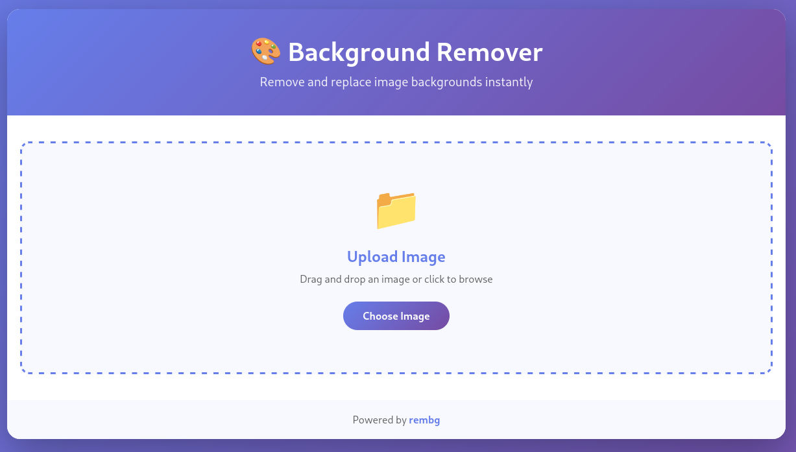
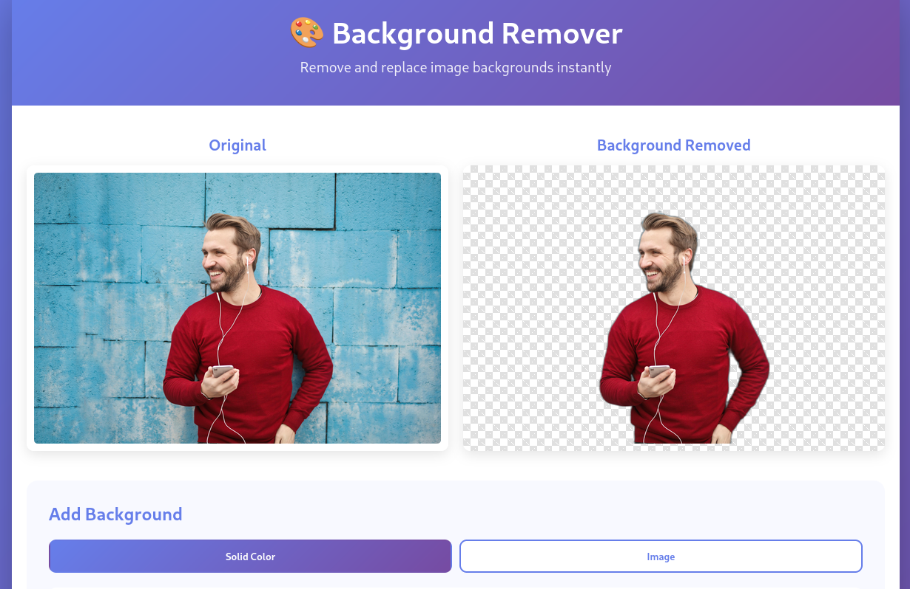
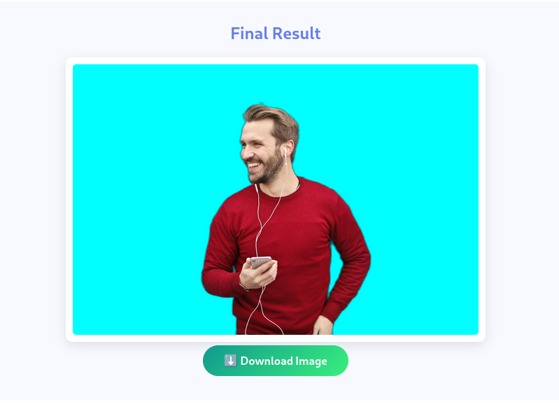
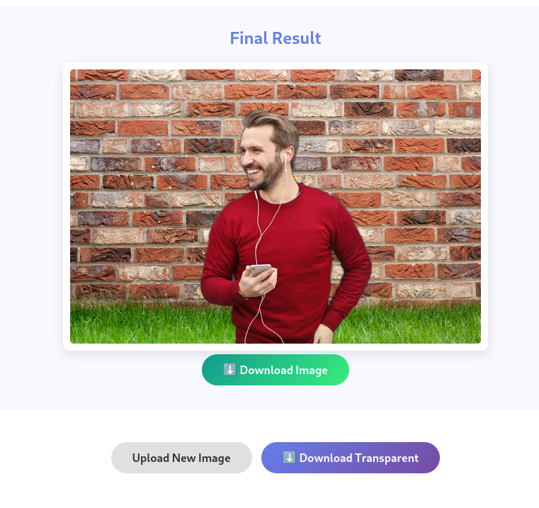

# Rembg GUI - Background Removal Tool

A beautiful and intuitive web-based GUI for the [rembg](https://github.com/danielgatis/rembg) Python library. Remove image backgrounds and replace them with solid colors or custom images, similar to remove.bg.

## Features

- 🎨 **Remove Background**: Instantly remove backgrounds from images using AI
- 🌈 **Solid Color Background**: Add any solid color as background with a color picker
- 🖼️ **Custom Image Background**: Upload and use custom images as backgrounds
- ⬇️ **Download Options**: Download both transparent and final images
- 📱 **Responsive Design**: Works on desktop, tablet, and mobile devices
- 🎯 **Drag & Drop**: Easy drag and drop interface for image upload
- ⚡ **Fast Processing**: Powered by rembg for quick background removal

## Screenshots

### Main Interface


### Background Removal Process


### Solid Color Background


### Custom Image Background


The application features:
- Clean, modern interface inspired by remove.bg
- Side-by-side comparison of original and processed images
- Preset color options for quick background selection
- Real-time preview of background changes

## Installation

### Prerequisites

- Python 3.8 or higher
- pip (Python package manager)

### Setup

1. Clone the repository:
```bash
git clone https://github.com/redevil1/rembg-gui.git
cd rembg-gui
```

2. Create and activate a virtual environment (recommended):

**On Linux/macOS:**
```bash
python3 -m venv venv
source venv/bin/activate
```

**On Windows:**
```bash
python -m venv venv
venv\Scripts\activate
```

3. Install dependencies:
```bash
pip install -r requirements.txt
```

4. Run the application:
```bash
python app.py
```

5. Open your browser and navigate to:
```
http://localhost:5000
```

## Usage

### Development Mode

1. Click "Choose Image" or drag and drop an image onto the upload area
2. Wait for the background to be removed automatically
3. Download the transparent image using "Download Transparent" button

### Production Deployment

For production use, it's recommended to:

1. Disable debug mode by setting `debug=False` in `app.py`, or
2. Use a production WSGI server like gunicorn:

```bash
pip install gunicorn
gunicorn -w 4 -b 0.0.0.0:5000 app:app
```

### Basic Background Removal

1. Click "Choose Image" or drag and drop an image onto the upload area
2. Wait for the background to be removed automatically
3. Download the transparent image using "Download Transparent" button

### Adding Solid Color Background

1. After background removal, click on "Solid Color" tab
2. Choose a color using the color picker or select from preset colors
3. Click "Apply Color Background"
4. Download the final image

### Adding Image Background

1. After background removal, click on "Image" tab
2. Click "Choose Background Image" and select an image
3. Click "Apply Image Background"
4. Download the final image

## Technology Stack

- **Backend**: Flask (Python web framework)
- **Background Removal**: rembg (AI-powered background removal)
- **Image Processing**: Pillow (PIL)
- **Frontend**: HTML5, CSS3, JavaScript (Vanilla)
- **Design**: Modern gradient design with responsive layout

## API Endpoints

### POST /api/remove-background
Remove background from an uploaded image.

**Request**: 
- Form data with `image` file

**Response**:
```json
{
  "success": true,
  "image": "data:image/png;base64,..."
}
```

### POST /api/add-background
Add a background (color or image) to a transparent image.

**Request**:
```json
{
  "foreground": "data:image/png;base64,...",
  "backgroundColor": "#ffffff"
}
```
OR
```json
{
  "foreground": "data:image/png;base64,...",
  "backgroundImage": "data:image/png;base64,..."
}
```

**Response**:
```json
{
  "success": true,
  "image": "data:image/png;base64,..."
}
```

## Project Structure

```
rembg-gui/
├── app.py                  # Flask backend application
├── requirements.txt        # Python dependencies
├── templates/
│   └── index.html         # Main HTML template
├── static/
│   ├── css/
│   │   └── style.css      # Styling
│   └── js/
│       └── script.js      # Frontend logic
├── uploads/               # Temporary upload directory
└── outputs/               # Temporary output directory
```

## Dependencies

- Flask==3.0.0
- flask-cors==4.0.0
- rembg==2.0.57
- Pillow==10.1.0

## Contributing

Contributions are welcome! Please feel free to submit a Pull Request.

## License

This project is licensed under the MIT License - see the LICENSE file for details.

## Acknowledgments

- [rembg](https://github.com/danielgatis/rembg) - The amazing background removal library
- [remove.bg](https://www.remove.bg/) - Inspiration for the UI/UX design

## Support

If you encounter any issues or have questions, please open an issue on GitHub.
